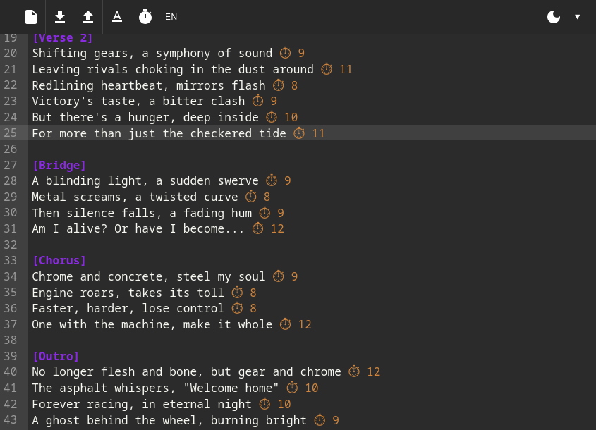

Versemonger is a text editor intended for writing song lyrics built using React and MaterialUI.

In the current form it only counts syllables in lines (in English or Polish) and everything run in the frontend.

The goal here is to have an editor that can assist with writing lyrics using (locally run) AI. The following features are planned:
- Write a song from scratch
- Write a section of a song from scratch (verse, chorus, bridge etc.)
- Suggest a line of text (multiple choices)
- Suggest a replacement for a word (multiple choices)
- Autocomplete style text suggestion

This will also be an experiment on accomplishing a task using a single prompt (system prompt, song description, lyrics and finally command become the context). This app is also practice in using ollama (or OpenAI) API as well as polishing React skills.

This application is mostly human made, but some AI assistance was used.